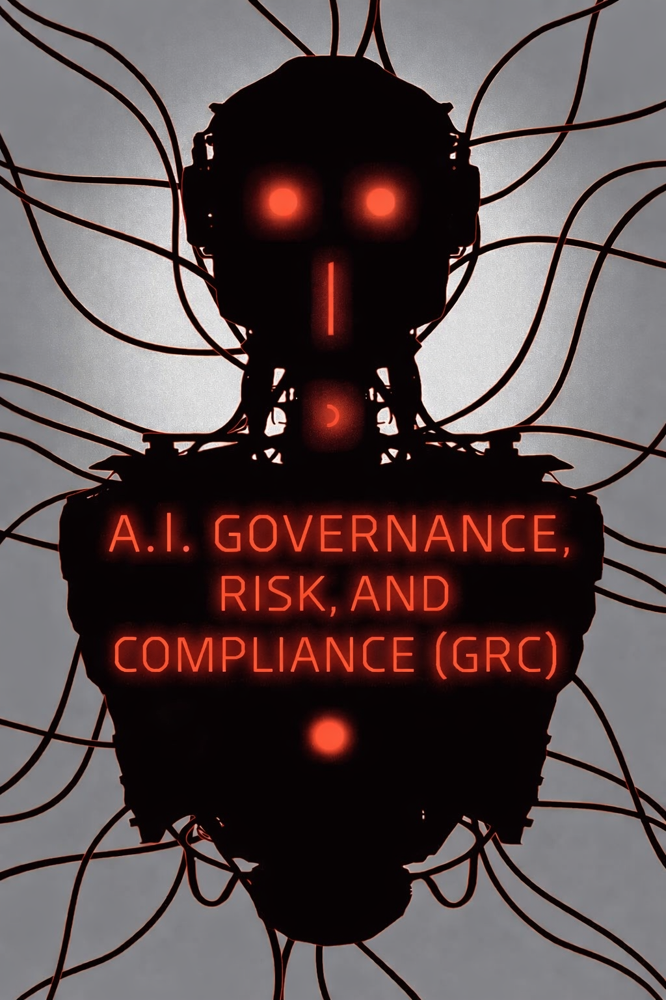

# Artificial Intelligence (AI) Architectural Governance, Risk, and Compliance (GRC)



## Table of Contents

- [Overview](#overview)
- [Getting Started](#getting-started)
  - [Prerequisites](#prerequisites)
- [Preface - Technology is Fleeting; Design is Forever](https://medium.com/i-did-a-thing/technology-is-fleeting-design-is-forever-ab894395dfb2)
- [A.I. Readiness]()
  - [Value Stream Mapping and Organizational Leadership](https://medium.com/i-did-a-thing/a-i-readiness-series-value-stream-mapping-and-organizational-leadership-9fd4d4d2ea0c)
  - [Data Architecture and Governance](https://medium.com/i-did-a-thing/a-i-readiness-series-data-architecture-and-governance-d79fe774518b)
- [A.I. Quality Control]()
  - [Software Development Life Cycle](https://medium.com/i-did-a-thing/a-i-quality-control-series-software-development-life-cycle-bc5f1ea84505)
  - [Automated Testing - Happy Birthday JUnit](https://www.linkedin.com/pulse/happy-birthday-junit-larry-johnson-x9xec/)
- [A.I. Governance, Risk, and Compliance (GRC)]()
  - [Introduction](https://medium.com/i-did-a-thing/a-i-governance-risk-and-compliance-grc-series-introduction-to-a-i-grc-f539c3b322a3)
  - [Managing GRC Through First Principles](https://medium.com/i-did-a-thing/a-i-governance-risk-and-compliance-grc-series-managing-grc-through-first-principles-33a7723c4787)
  - [Architectural Governance Part I](https://medium.com/i-did-a-thing/a-i-governance-risk-and-compliance-grc-series-architectural-governance-part-i-ac80e5386d50)
  - [Architectural Governance Part II](https://medium.com/@johnson.larry.l/a-i-governance-risk-and-compliance-grc-series-architectural-governance-part-ii-a3d2e5ee68d4)
  - [Architectural Governance Case Study](https://medium.com/@johnson.larry.l/a-i-governance-risk-and-compliance-grc-series-architectural-governance-case-study-e5b33a1b3a38)
    - [Fitness Function for LLM Latency](docs/architectural_governance_case_study/README.md)
- [Lessons in A.I. from a Budding Machine Learning Engineer]()
  - [Introduction](https://www.linkedin.com/pulse/i-did-thing-part-lessons-ai-from-budding-machine-learning-johnson/?trackingId=%2FaLqrzghRQ%2B6Pzh6qY07Cw%3D%3D)
  - [Data Literacy](https://www.linkedin.com/pulse/lessons-ai-from-budding-machine-learning-engineer-data-johnson/)
  - [Sweet Potato Pie](https://www.linkedin.com/pulse/lessons-ai-from-budding-machine-learning-engineer-sweet-johnson/)
  - [Mixed Fruit](https://www.linkedin.com/pulse/lessons-ai-from-budding-machine-learning-engineer-mixed-johnson/)
  - [Getting to the Core - Part I](https://medium.com/@johnson.larry.l/lessons-in-a-i-from-a-budding-machine-learning-engineer-getting-to-the-core-6c9f649eea78)
  - [Getting to the Core - Part II](https://medium.com/@johnson.larry.l/lessons-in-a-i-from-a-budding-machine-learning-engineer-getting-to-the-core-part-ii-5bc78109eb37)
  - [Finding the Right Recipe](https://medium.com/@johnson.larry.l/lessons-in-a-i-from-a-budding-machine-learning-engineer-finding-the-right-recipe-f34772386891)
  - [A Brief Introduction to Reinforcement Learning Part I](https://medium.com/@johnson.larry.l/lessons-in-a-i-0e164c405a0d)
  - [A Brief Introduction to Reinforcement Learning Part II](https://medium.com/@johnson.larry.l/lessons-in-a-i-from-a-budding-machine-learning-engineer-getting-to-the-core-part-ii-5bc78109eb37)
- [License](#license)
## Getting Started

These instructions will get you a copy of the project up and running on your local machine for development and testing purposes. See deployment for notes on how to deploy the project on a live system.

### Prerequisites

* [git](https://git-scm.com/book/en/v2/Getting-Started-Installing-Git)
* [ssh key](https://docs.github.com/en/enterprise/2.15/user/articles/adding-a-new-ssh-key-to-your-github-account)
* [awscli](https://docs.aws.amazon.com/cli/latest/userguide/install-cliv1.html)
* [![Poetry][Poetry.org]][Poetry-url]
* [![Docker][Docker.com]][Docker-url]
* [![Python][Python.org]][Python-url]

## Overview
Artificial Intelligence is no longer just a technical discipline—it is an organizational capability that brings together data, models, governance, and decision-making into a unified system. This body of work explores AI not only from the perspective of building machine learning models, but also through the broader lenses of data literacy, system design, and enterprise-scale decision intelligence. The journey begins with foundational insights in *Lessons in A.I. from a Budding Machine Learning Engineer*, where practical experience shapes an understanding of how AI systems are developed in real-world environments. From there, *Data Literacy* emphasizes the importance of understanding data as the core ingredient in any intelligent system.

Using relatable metaphors, the series continues with *Sweet Potato Pie* and *Mixed Fruit*, illustrating how raw ingredients—data, features, and transformations—must be carefully combined to produce meaningful outcomes. This leads into deeper technical exploration in *Getting to the Core – Part I* and *Part II*, where the inner workings of models and feature representations are examined more closely. Building on this foundation, *Finding the Right Recipe* focuses on selecting appropriate algorithms and approaches for specific problems, reinforcing the idea that successful AI systems depend on both art and science. The series then introduces adaptive decision-making through *A Brief Introduction to Reinforcement Learning – Part I* and *Part II*, highlighting how systems can learn from interaction and feedback to improve over time.

As AI systems become embedded in enterprise environments, Architectural Governance, Risk, and Compliance (GRC) becomes essential. Governance is no longer a static checkpoint but an integrated, continuous process within the architecture itself. By embedding fitness functions and automated validation into the development lifecycle, organizations can ensure that AI systems remain reliable, explainable, and aligned with both regulatory requirements and business objectives. This approach transforms governance into a dynamic capability—one that evolves alongside the system while maintaining accountability and trust.

At its core, AI is about decision-making, and this is where Enterprise Decision Management (EDM) plays a critical role. AI models are not isolated artifacts; they are components within larger decision pipelines that influence operations, strategy, and customer outcomes. By combining AI with structured decision frameworks, organizations can move beyond reactive analytics toward proactive and even autonomous systems. When paired with approaches like reinforcement learning, these systems continuously refine their decisions based on feedback, enabling more intelligent and adaptive behavior over time.

Ultimately, AI is not just about building models—it is about building systems that learn, adapt, and make decisions responsibly. By integrating strong data foundations, thoughtful model design, and embedded governance, organizations can unlock the full potential of AI while maintaining control, transparency, and long-term value.

## Usage

#### Get an OpenAI API key

Visit [OpenAI website](https://developers.openai.com/api/docs/quickstart) to learn how to create and use an OpenAI API key.

#### Create a `.env` file

```env
OPENAI_API_KEY=your-openai-api-key
```

#### Start the application using Docker so it runs in the background, then open a shell inside the running container to interact with it and run commands directly.

```
docker compose build
docker compose up -d
docker compose exec architectural-grc bash
```

## License

**© Larry Johnson. All rights reserved.**

[Python-url]:https://python.org
[Python.org]:https://img.shields.io/badge/Python-3776AB?style=for-the-badge&logo=python&logoColor=white
[Poetry-url]: https://python-poetry.org
[Poetry.org]: https://img.shields.io/badge/Poetry-60A5FA?style=for-the-badge&logo=poetry&logoColor=white
[Docker-url]: https://www.docker.com/
[Docker.com]: https://img.shields.io/badge/Docker-2496ED?style=for-the-badge&logo=docker&logoColor=white